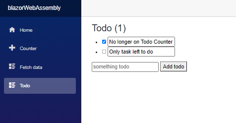

##Microsoft Learning Patch for Blazor ToDo App: https://docs.microsoft.com/en-us/learn/modules/build-blazor-webassembly-visual-studio-code/3-exercise-configure-enviromnent

###Purpose

    After completing the very quick tutorial on the Microsoft docs for Blazor, I decided I needed to find a lengthier tutorial. The Blazor App in this repository will be created as I go through the learning patch linked in the header. I hope to better understand the blazor components. I also plan to follow this tutorial with the React online tutorial, as I'm sensing a familar pattern between the two. 

    <h4>Notes</h4>
    <ol>
        <li><b>Razor Components</b> - Razor files define components that make up a portion of the app UI</li>
        <li>At compile time, every Razor component is built into a .NET class (includes UI elements like state, rendering logic, lifecycle methods and event handlers)</li>
        <li>**First three sections of learning path is just a review of the counter app</li>
        <li>Layouts: Components that allow you to avoid duplication of content in an app</li>
        <li>**Reminder: The .razor page is the component (it is a razor component)</li>
        </ol>

  

